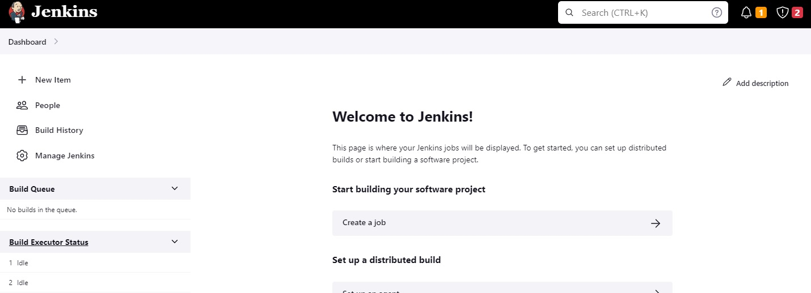
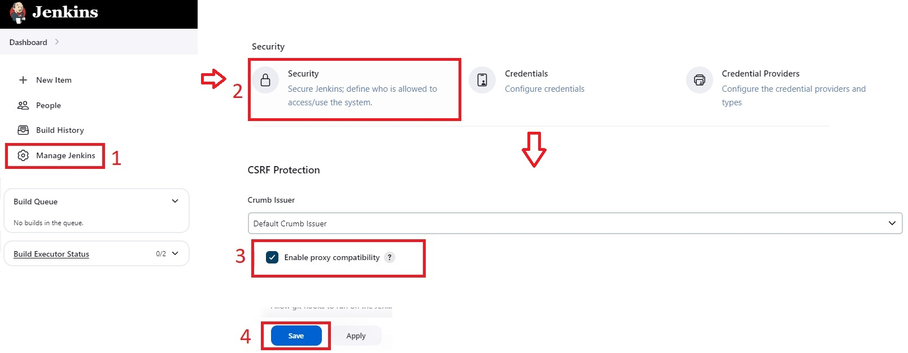
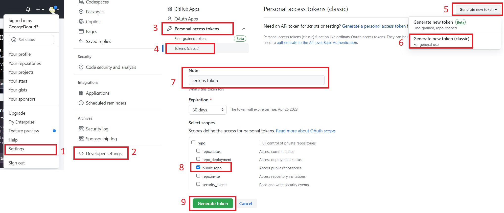
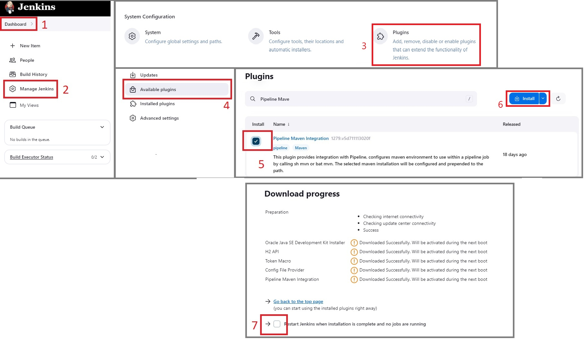
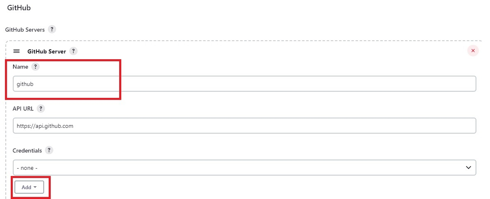
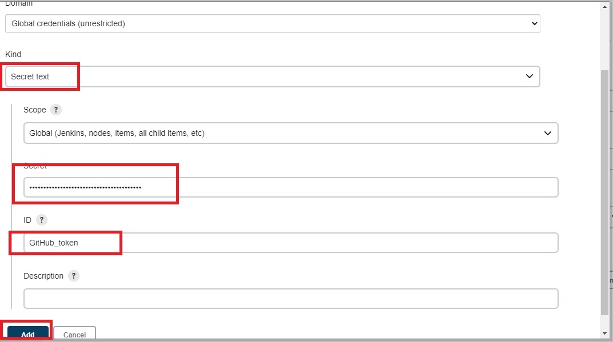
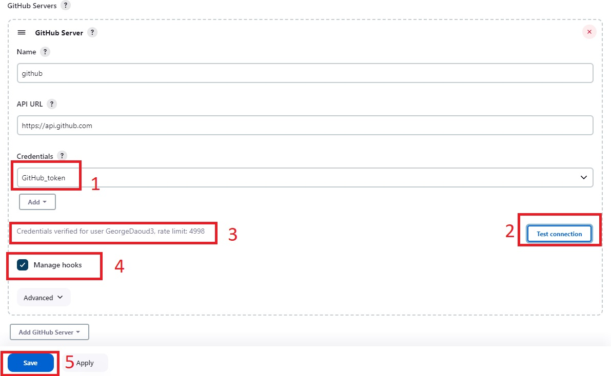
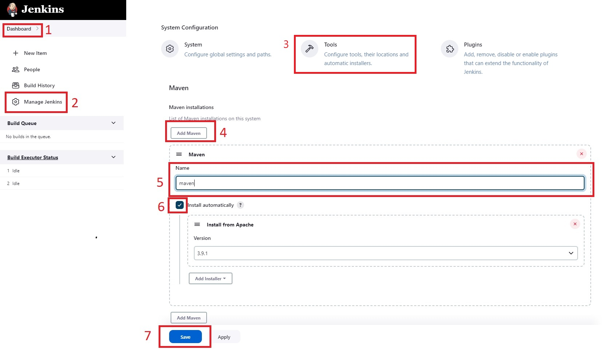
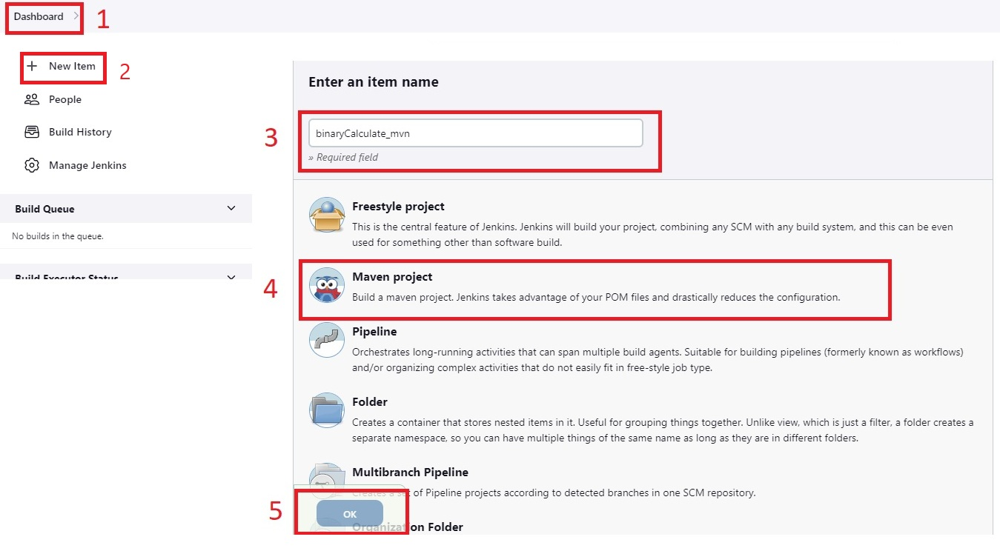

# Milestone 4: Continuous Integration and Continuous Delivery (Jenkins) 
## Objective   
## Repository:   
[https://github.com/GeorgeDaoud3/SOFE3980U-Lab4.git](https://github.com/GeorgeDaoud3/SOFE3980U-Lab4.git) 

## Introduction and Getting started
1. Watch the following video about [Dev-ops](https://www.youtube.com/watch?v=LFDrDnKPOTg).
2. Install Jenkins Server on GCP, using Helm. Helm is a tool to create a customized applications within Kubernetes.
   1. Watch the following video about [Helm](https://www.youtube.com/watch?v=fy8SHvNZGeE).
   2. If there is no Kubernetes cluster within your GCP project, Create a cluster as illustrated in [MS3](https://github.com/GeorgeDaoud3/SOFE3980U-Lab3#setup-google-kubernetes-engine-gke). To get the cluster information.
      ```cmd
      kubectl cluster-info
      ``` 
   3. Pull the Jenkins Helm chart from a repository.  
      ```cmd
      helm repo add jenkinsci https://charts.jenkins.io
      helm repo update
      ```
   4. Clone the repository for the Helm values.
      ```cmd
      cd ~
      git clone https://github.com/GeorgeDaoud3/SOFE3980U-Lab4.git
      ```
   5. Use the Helm CLI to deploy the chart **cd-jenkins** with the configuration set from the repository **jenkins/values.yaml** onto Kubernetes with the name **cd-jenkins**.
      ```cmd
      helm install cd-jenkins -f ~/SOFE3980U-Lab4/jenkins/values.yaml jenkinsci/jenkins --wait
      ```
   6. **(optional)** to remove the **cd-jenkins** from Kubernetes. **<ins>Don’t run it now</ins>**.
      ```cmd
      helm uninstall cd-jenkins
      ```
   7. Retrieve Jenkins external IP,
      ```cmd 
      kubectl get services
      ```
      
   8. Access Jenkins server using the following URL http://\<jenkinsIP\>:8080. Where \<jenkinsIP\> is the IP obtained in the previous step. It should look like
      
   9. To fix a connection issue, **Manage Jenkins**, select **configure Global Security**, under **CSRF Protection**, and check **Enable proxy compatibility**. Click **save** button. (Note the connection issue won’t be fixed until the configuration is saved. You may need to repeat this step until the configuration is saved)
      
## Create a Maven project job
1. Create a GitHub account. Create a repository. Copy the content of the [repository](https://github.com/GeorgeDaoud3/SOFE3980U-Lab4.git) into your repository ( or simply fork it ).
2. Create a GitHub token: Within the GitHub page, login into your account. Choose  **settings**, **Developer settings**, **Personal access token**, then, **Token (classic)**. Click **Generate new token**. Select **Generate new token (classic)**. Set the note, check **public_repo** and click **Generate token**. Finally, copy the token code.
   
3. Install **Pipeline Maven Integration** Plugin: select **Dashboard**, **Manage Jenkins**, then, **Manage Plugins**. Choose **Available Plugins**. Search for **Pipeline Maven Integration**. After checking it, click **Download now and install after restart**. Check **Restart Jenkins when installation is complete and no jobs are running**. Finally, wait until the plugin is intalled and Jenkins restarts.
   
4. Repeat the previous step to install **Maven Integration** plugin
5. Repeat the previous step to install **GitHub** plugin
6. Configure GitHub Plugin
   1. Select **Dashboard**, **Manage Jenkins**, then, **Configure System**. Scroll down to the **GitHub** section. Click **Add GitHub Server** button. Name it **github**. Click **Add** for a credential.
      
   2. Choose the kind to be **secret text**. Type Github token obtained in step 2 in the **secret** textbox. Set its **ID** to be **GitHub_token**. Finally, click **ADD**.
      
   3. Set the **credential** to **GitHub_token**. Test the connection. Then, click **Save**.
      
7. Configure Maven Plugin: select **Dashboard**, **Manage Jenkins**, **Global Tool Configuration**, choose **Add Maven**, name it **maven**, choose **Install automatically**, click **save**.
   
8. Create a Job: select **Dashboard**. Click **create a job**. Name it **binaryCalculate_mvn**, and choose **Maven Project**. Finally, click **Ok**.
   
